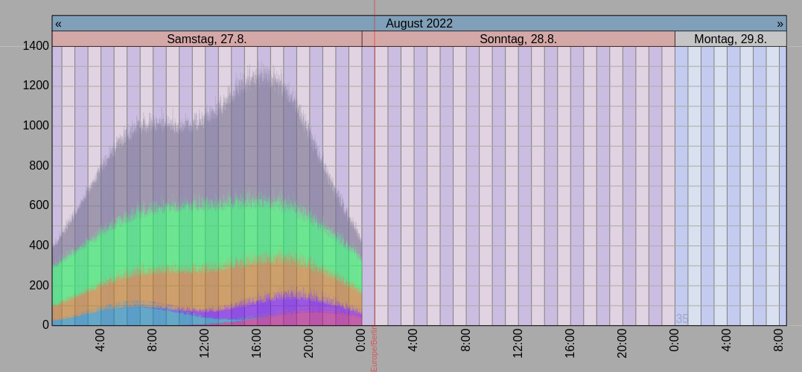

# timeseries.js
This small project aims to display any absolute events and time series in an interactive and very manageable way. In each selected scale, one should be able to classify the absolute time frame at a glance. In the same display, it should be able to serve as a calendar as well as display time series such as temperature curves. Try the [demo](https://hgruber.github.io/timeseries.js/index.html) to experience the intuitive dragging and zooming.

## working features
* Use of Javascript canvas enables fluid navigation by dragging and zooming (mouse wheel)
* Correct handling of daylight saving times for all days using the browser's time zone
* Time axis behaves like a calendar also showing working days and holidays (not yet configurable)
* The current time is constatntly in motion
* When the current time touches the right border, the chart switches to rolling mode (like a seismograph).

## planned features
* different graph types: lines, bars (single, stacked, up and down), gant chart, ..
* automatic data query depending on user interaction (highly configurable to allow different backends)
* ical and caldav (client) support
