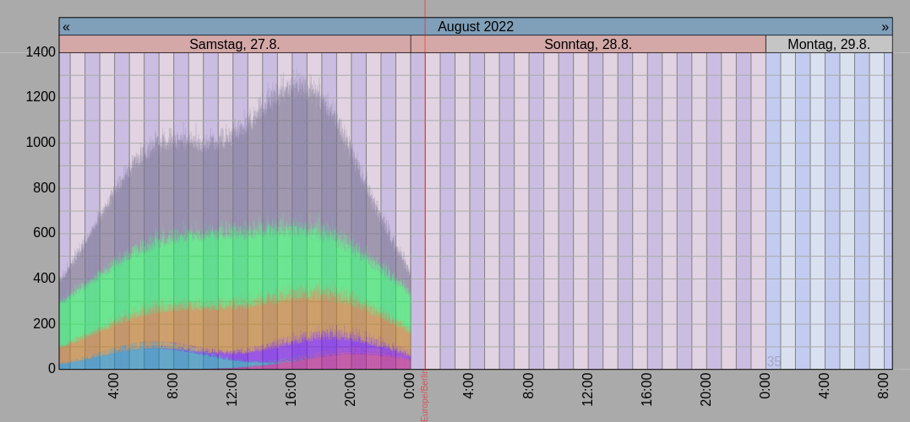

# timeseries.js

A lightweight, dependency-free JavaScript library for interactive time series visualization on HTML canvas. Designed for fluid navigation at any time scale — from minutes to years — with correct daylight saving time handling and calendar-aware labeling.

[](https://hgruber.github.io/timeseries.js/index.html)

**[Live demo](https://hgruber.github.io/timeseries.js/index.html)**

---

## Features

- **Fluid navigation** — drag to pan, scroll wheel to zoom, animated transitions on click
- **Calendar-aware time axis** — labels adapt to the zoom level (day/month/year), shows calendar weeks, public holidays, and working days
- **Daylight saving time** — all day and month boundaries computed correctly in the browser's local time zone
- **Rolling mode** — when the current time reaches the right edge, the chart follows it like a seismograph
- **Plugin architecture** — register custom renderers and data sources without modifying library code
- **Built-in chart types** — stacked bars (`multibar`), lines (`multiline`), scatter points (`multipoint`)
- **Built-in data sources** — Zabbix JSON-RPC API, static/generated data

---

## Getting started

### Via script tag (production)

```html
<script src="dist/timeseries.js"></script>
<script>
  const ts = new TimeSeries({
    canvas: 'my-canvas-id',
    sources: [ myPlotObject ]
  });
</script>
```

### Development

```bash
npm run build   # build dist/timeseries.js first
npm run serve   # static server on :8080
# open http://localhost:8080/demo/index.html
```

---

## Building

```bash
npm install          # installs esbuild (only dev dependency)
npm run build        # bundle → dist/timeseries.js
npm run build:min    # minified → dist/timeseries.min.js
npm run watch        # rebuild on file changes
npm run serve        # static server on :8080
```

---

## Navigation API

```js
ts.today()       ts.yesterday()   ts.tomorrow()
ts.thisWeek()    ts.lastWeek()    ts.nextWeek()
ts.last24()      ts.next24()

ts.zoom(tmin, tmax, animationMs)   // tmin/tmax: Unix ms
```

---

## Plugin interfaces

### Custom renderer

```js
TimeSeries.registerRenderer({
  type: 'my-type',
  draw(plot, rctx) {
    // rctx: { c, X, Y, ppms, ppv, margin, plotWidth, plotHeight }
  },
  highlight(plot, n, item, rctx) { /* optional */ }
});
```

### Custom data source

```js
TimeSeries.registerSource({
  type: 'my-source',
  init(source, callbacks) {
    // callbacks: { pushData(plotObj), requestRedraw(), getViewport() → {tmin, tmax} }
  }
});
```

---

## Plot object format

```js
{
  type: 'multibar',          // or 'multiline', 'multipoint'
  interval_start: number,    // Unix seconds
  interval_end: number,
  interval: number,          // seconds per slot
  count: number,
  min: number,
  max: number,
  data: { [slotIndex]: { [seriesId]: value } }
}
```

---

## License

MIT
