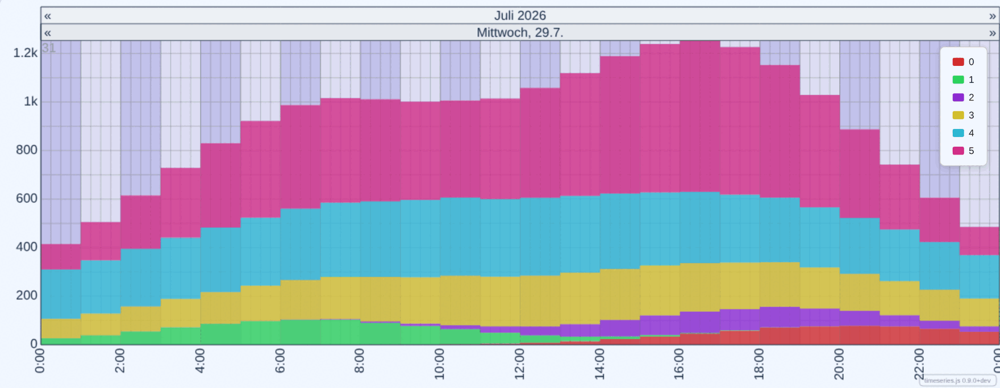
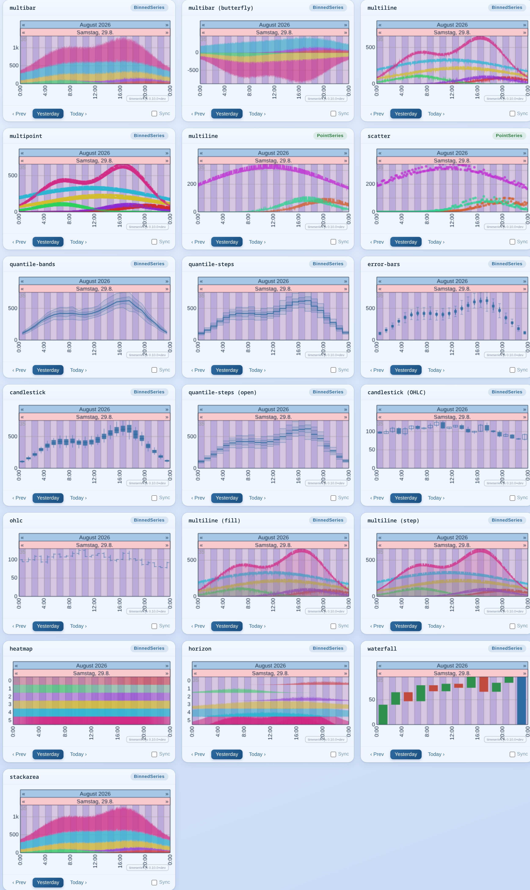
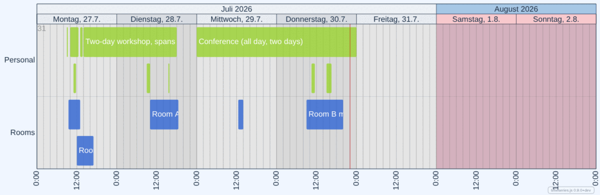
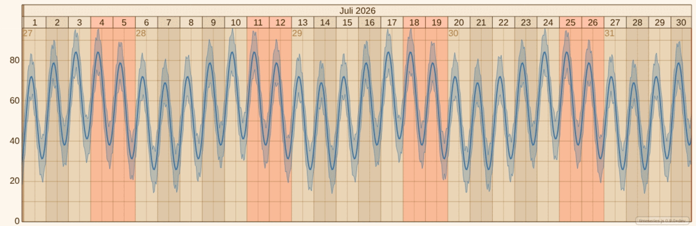
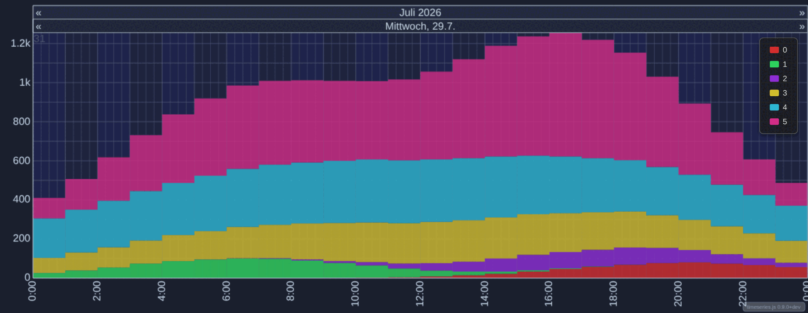

# timeseries.js

[](https://github.com/hgruber/timeseries.js/actions/workflows/deploy.yml)
[](https://www.npmjs.com/package/@hgruber/timeseries.js)
[](LICENSE)
[](https://github.com/hgruber/timeseries.js/releases)

A lightweight, dependency-free JavaScript library for interactive time series visualization
on HTML canvas. Designed for fluid navigation at any time scale — from minutes to years —
with correct daylight saving time handling and calendar-aware labeling.

No build step, no checkout: one `<script>` tag and you have a chart.

**[▶ Live demo](https://hgruber.github.io/timeseries.js/demo/)** · **[📖 Documentation](doc/)**

[](https://hgruber.github.io/timeseries.js/demo/)

---

## Quick start

Save this as an HTML file and open it. That is the whole setup.

```html
<canvas id="chart" style="width: 900px; height: 360px"></canvas>

<script src="https://cdn.jsdelivr.net/npm/@hgruber/timeseries.js@0.10/dist/timeseries.min.js"></script>
<script>
  // 24 hourly slots, two series each.
  const t0 = Math.floor(Date.now() / 3600000) * 3600 - 23 * 3600;   // Unix seconds, on the hour
  const data = {};
  for (let i = 0; i < 24; i++) {
    data[i] = { ok: 50 + Math.round(40 * Math.random()),
                error: Math.round(10 * Math.random()) };
  }

  const ts = new TimeSeries({
    canvas: 'chart',                 // id of the <canvas> above
    initialView: 'last24',           // frame the last 24 hours on load
    yAxisLabel: 'txn/h',
    sources: [{
      'source-type': 'artificial',   // "here is the data" — no fetching
      type: 'multibar',              // stacked bars
      interval_start: t0,            // Unix seconds
      interval_end: t0 + 24 * 3600,
      interval: 3600,                // seconds per slot
      count: 24,
      min: 0, max: 130,
      data,                          // { slot: { seriesId: value } }
    }],
  });

  TimeSeries.attachTooltip(ts);      // hover card
  TimeSeries.attachLegend(ts);       // click a series to hide it
</script>
```

Drag to pan, scroll to zoom (shift+scroll to pan), click a time label to zoom to it,
arrow keys to page and zoom — snapped to the axis grid at every zoom level.

> Using it for real? Pin a version — `@0.10` tracks patch releases, `@0.10.0` is immutable.
> With a bundler: `npm i @hgruber/timeseries.js`.
> Details in [Getting started](doc/getting-started.md#installing).

**Next:** [more examples](doc/recipes.md) · [your data's shape](doc/data-formats.md) ·
[connect to a server](doc/sources.md) · [all options](doc/configuration.md)

---

## What it looks like

| | |
|---|---|
| [](https://hgruber.github.io/timeseries.js/demo/) | **Fourteen built-in plot types** — stacked bars, butterfly, waterfall, lines (plain, stepped or filled), stacked areas, points, scatter, heatmaps, horizon bands, and five ways to draw a distribution per bin: percentile bands, stepped bands, error bars, candlesticks and OHLC bars.<br>[`demo/index.html`](https://hgruber.github.io/timeseries.js/demo/) |
| [](https://hgruber.github.io/timeseries.js/demo/caldav.html) | **Spans and Gantt rows** — calendar events, job runs, outages. Rows are packed automatically; lanes keep sources apart.<br>[`demo/caldav.html`](https://hgruber.github.io/timeseries.js/demo/caldav.html) |
| [](https://hgruber.github.io/timeseries.js/demo/zabbix.html) | **Zoom-adaptive resolution** — a fine tier and a coarse one held at once and dissolved into each other, so crossing the boundary has no visible pop.<br>[`demo/zabbix.html`](https://hgruber.github.io/timeseries.js/demo/zabbix.html) |
| [](https://hgruber.github.io/timeseries.js/demo/) | **Four themes, one call** — `ts.setColors(TimeSeries.themes.dark)` re-themes the chart and its overlays together.<br>[Colours & themes](doc/configuration.md#colours-and-themes) |

---

## Features

- **Fluid navigation** — drag to pan, wheel to zoom, animated transitions, arrow-key paging
- **Calendar-aware time axis** — labels adapt to the zoom level, with ISO calendar weeks,
  public holidays and working days
- **Correct DST** — every day, week and month boundary computed in the browser's local zone
- **Rolling mode** — the chart follows "now" like a seismograph when it reaches the edge
- **Viewport sync** — several charts pan, zoom and follow together
- **Zoom-adaptive resolution** — two tiers of one signal cross-faded as bars get too narrow
- **Smart downsampling** — LTTB keeps large point series fast without losing their shape
- **Built-in plot types** — `multibar`, `multiline` (with `step`/`fill`), `stackarea`,
  `waterfall`, `multipoint`, `scatter`, `heatmap`, `horizon`, `gantt`, and five renderers
  for a distribution per bin: `quantile-bands`, `quantile-steps`, `error-bars`,
  `candlestick`, `ohlc`
- **Bin-local distributions** — the four types beside `quantile-bands` draw each bin on its
  own, so nothing is interpolated across a gap where nothing was measured
- **Categorical y-axis** — `heatmap`, `horizon` and `gantt` give each series its own row,
  labelled by name instead of by number
- **Built-in data sources** — `artificial` (pass-through), `zabbix` (JSON-RPC), `caldav`
  (WebDAV + iCalendar), `prometheus` (covers VictoriaMetrics, Thanos, Cortex, Mimir),
  `influxdb` (InfluxQL 1.x and Flux 2.x from one source), `home-assistant`,
  `websocket` and `duckdb-wasm` adapters
- **Opt-in tooltip & legend** — one call each, themed from the palette, overridable at every
  level
- **Persistent selection** — mark the bar a detail panel refers to with one call; the
  outline survives refetches, polls and zoom, and repaints only while the bar is visible
- **Plugin architecture** — register your own renderers and sources without touching the
  library
- **Four themes** — light, dark, high-contrast and warm, swappable at runtime

---

## Already running Grafana or Zabbix?

Those are dashboard platforms; timeseries.js is the chart itself, embedded directly in a
page you control — no iframe, no server, DST-correct keyboard navigation and a resolution
switch with no visible pop. It doesn't replace alerting or long-term storage, and its
built-in [Zabbix](doc/sources.md) and [CalDAV](doc/sources.md) sources are there for
exactly that pairing. See [the full comparison](doc/comparison.md).

---

## Documentation

| Page | For |
|---|---|
| [Getting started](doc/getting-started.md) | Installing, version pinning, your first chart, the usual pitfalls |
| [Data formats](doc/data-formats.md) | The shape your data has to arrive in — binned, point, quantile, span |
| [Configuration](doc/configuration.md) | Every constructor option, themes, holidays, keyboard |
| [API reference](doc/api.md) | Every method and static, grouped by task |
| [Overlays](doc/overlays.md) | `attachTooltip` and `attachLegend` |
| [Data sources](doc/sources.md) | `artificial`, `zabbix`, `caldav`, `prometheus`, `influxdb`, `home-assistant`; `websocket` and `duckdb-wasm` adapters; CORS |
| [Resolution tiers](doc/tiers.md) | The cross-fade, `rollupBinned`, the rate axis |
| [Plugins](doc/plugins.md) | Writing a renderer or a data source |
| [Recipes](doc/recipes.md) | Copy-paste examples, one per task |
| [Development](doc/development.md) | Build, test, demos, releasing |
| [Performance](benchmark/README.md) | CPU time and TTFR against uPlot and Chart.js |

Start at [doc/](doc/) for the full index, including a "what do I want to do" table.

---

## License

MIT — see [LICENSE](LICENSE).
