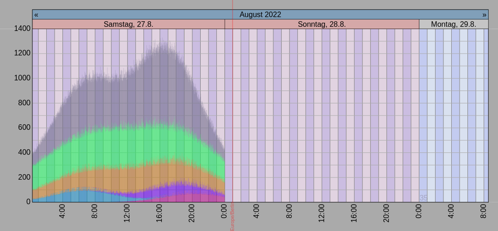

# timeseries.js

[](https://github.com/hgruber/timeseries.js/actions/workflows/deploy.yml)
[](https://www.npmjs.com/package/timeseries.js)
[](LICENSE)
[](https://github.com/hgruber/timeseries.js/commits/main)
[](https://github.com/hgruber/timeseries.js/releases)

A lightweight, dependency-free JavaScript library for interactive time series visualization on HTML canvas. Designed for fluid navigation at any time scale — from minutes to years — with correct daylight saving time handling and calendar-aware labeling.

**[Live demo](https://hgruber.github.io/timeseries.js/demo/)**

[](https://hgruber.github.io/timeseries.js/demo/)

---

## Features

- **Fluid navigation** — drag to pan, scroll wheel to zoom, animated transitions on click
- **Calendar-aware time axis** — labels adapt to the zoom level (day/month/year), shows calendar weeks, public holidays, and working days
- **Daylight saving time** — all day and month boundaries computed correctly in the browser's local time zone
- **Rolling mode** — when the current time reaches the right edge, the chart follows it like a seismograph
- **Viewport sync** — synchronize multiple chart instances' viewports to zoom/pan together
- **Smart downsampling** — LTTB algorithm optimizes rendering performance for large PointSeries datasets
- **Extended navigation** — month/year navigation, calendar weeks (ISO 8601), plus date helpers for day/week intervals
- **Plugin architecture** — register custom renderers and data sources without modifying library code
- **Customizable colors** — 4 built-in color schemas to match your theme
- **Opt-in tooltip & legend** — one call each for a themed hover card and a click-to-toggle series legend that follow the palette; override the label, the formatting, or the whole body
- **Built-in chart types** — stacked bars (`multibar`), lines (`multiline`), points (`multipoint`), scatter (`scatter`), percentile bands (`quantile-bands`), calendar/Gantt spans (`gantt`)
- **Built-in data sources** — Zabbix JSON-RPC API, CalDAV calendars, static/generated data
- **Drop-in via CDN** — one `<script>` line, no build step, no checkout ([recipes](#connect-to-a-real-server)); or `npm i timeseries.js` if you have a bundler

---

## Getting started

### Via script tag (production)

```html
<canvas id="chart" style="width: 900px; height: 360px"></canvas>

<script src="https://hgruber.github.io/timeseries.js/dist/timeseries.min.js"></script>
<script>
  // A minimal stacked-bar dataset: 24 hourly slots, two series each.
  const today0 = Math.floor(new Date().setHours(0, 0, 0, 0) / 1000);
  const data = {};
  for (let i = 0; i < 24; i++) {
    data[i] = { ok: Math.round(50 + 40 * Math.random()),
                error: Math.round(5 + 10 * Math.random()) };
  }

  const ts = new TimeSeries({
    canvas: 'chart',                 // id of the <canvas> element
    initialView: 'today',            // frame the current day on load
    yAxisLabel: 'txn/h',
    sources: [{
      'source-type': 'artificial',   // built-in pass-through source
      type: 'multibar',              // renderer: stacked bars
      name: 'transactions',
      interval_start: today0,        // Unix seconds
      interval_end: today0 + 24 * 3600,
      interval: 3600,                // seconds per slot
      count: 24,
      min: 0, max: 120,
      data,                          // { slotIndex: { seriesId: value } }
    }],
  });
</script>
```

That is the whole setup — no build, no checkout. That URL always serves the latest
build; for production, pin a version instead — see
[Which URL to use](#which-url-to-use) below.

The canvas must have a non-zero CSS width/height — the library reads
`clientWidth`/`clientHeight` once at construction and sizes its backing
store from them.

### Via npm

```bash
npm i timeseries.js
```

```js
import TimeSeries from 'timeseries.js';        // ES modules, from src/
const TimeSeries = require('timeseries.js');   // the IIFE bundle, from dist/
```

### Which URL to use

| | |
|---|---|
| `…/npm/timeseries.js@0.9.0/dist/timeseries.min.js` | **one exact version.** Immutable — npm never lets a published version change. Use this in production. |
| `…/npm/timeseries.js@0.9/dist/timeseries.min.js` | **the latest 0.9.x.** Picks up fixes, never a breaking change (see [Versioning](#versioning)). |
| [`hgruber.github.io/timeseries.js/dist/timeseries.min.js`](https://hgruber.github.io/timeseries.js/dist/timeseries.min.js) | **always the tip of `main`.** Rebuilt on every push, deliberately unpinned — for trying things out, not for production. |

Prefix the first two with `https://cdn.jsdelivr.net`; `https://unpkg.com` serves
the same paths. Both bundles — `timeseries.min.js` (~73 kB) and the unminified
`timeseries.js`, readable in devtools — are available at every version, and are
also attached to each [GitHub release](https://github.com/hgruber/timeseries.js/releases)
if you would rather host a fixed copy yourself. All are IIFE bundles exposing a
global `TimeSeries`, served with `Access-Control-Allow-Origin: *`.

`TimeSeries.VERSION` tells you which version is loaded, and `TimeSeries.BUILD`
identifies the build when it is not a release — it is empty for a published
version and carries the commit for the always-latest URL above.

### Versioning

The project is pre-1.0 and follows the usual 0.x convention:

- a **minor** bump (`0.9.0` → `0.10.0`) may break the public API,
- a **patch** bump (`0.9.0` → `0.9.1`) never does.

So `^0.9.0` in a `package.json`, or `@0.9` in a CDN URL, gets you fixes without
surprises. Every release is listed in [CHANGELOG.md](CHANGELOG.md), and breaking
changes are called out there under *Changed* or *Removed*.

---

## Connect to a real server

Two recipes, one HTML file each, no npm and no checkout. Both put the file on the
**same web server that serves the API** — an origin is scheme + host + port, so
the path does not matter and the browser makes no cross-origin check at all. If
that is not possible, see [Cross-origin (CORS)](#cross-origin-cors) below.

### Zabbix

1. **Get a token** — Zabbix frontend → *User settings → API tokens → Create API
   token*. A read-only user is enough.
2. **Get an item id** — *Monitoring → Latest data*, open the item; the URL
   carries `itemid=…`.
3. **Drop the file next to the frontend** — save it as `ts.html` anywhere on the
   host serving Zabbix (e.g. `/usr/share/zabbix/ts.html`) and open
   `https://<zabbix-host>/ts.html`.

```html
<!DOCTYPE html>
<meta charset="utf-8">
<title>Zabbix — timeseries.js</title>
<canvas id="chart" style="width:100%;height:360px"></canvas>

<script src="https://hgruber.github.io/timeseries.js/dist/timeseries.min.js"></script>
<script>
  const ts = new TimeSeries({
    canvas: 'chart',
    initialView: 'last24',
    yAxisLabel: 'value',
    sources: [{
      'source-type': 'zabbix',
      url: '/zabbix/api_jsonrpc.php',   // relative = same origin = no CORS
      'auth-token': 'PASTE_YOUR_API_TOKEN',
      itemids: [12345],                 // from step 2
      'value-type': 0,                  // 0 = float, 3 = unsigned — must match the item
      name: 'CPU load',
    }],
  });

  TimeSeries.attachTooltip(ts);
  TimeSeries.attachLegend(ts);
</script>
```

Panning and zooming refetch as needed: the source keeps a 60 s `history` and a
1 h `trends` tier side by side and dissolves one into the other as you zoom —
see [Zabbix (history and trends)](#zabbix-history-and-trends) for the tier and
prefetch options.

`'value-type'` is the usual reason for an empty chart: if it does not match the
item, `history.get` returns an empty list without an error (trends still arrive,
so the chart fills in as soon as you zoom out).

A username and password work too — swap `'auth-token'` for `username`/`password`
— but a token can be revoked server-side, which a password cannot.

### CalDAV

1. **Create an app password** — e.g. Nextcloud: *Settings → Security → Create new
   app password*. Do not use your login password.
2. **Note the DAV base URL** — Nextcloud: `/remote.php/dav/`. With no `calendars`
   list the source discovers every calendar of that user itself.
3. **Drop the file on the same host** — anywhere on the server answering the DAV
   URL (the path is irrelevant, only scheme/host/port count) and open it.

```html
<!DOCTYPE html>
<meta charset="utf-8">
<title>CalDAV — timeseries.js</title>
<canvas id="chart" style="width:100%;height:420px"></canvas>

<script src="https://hgruber.github.io/timeseries.js/dist/timeseries.min.js"></script>
<script>
  const ts = new TimeSeries({
    canvas: 'chart',
    initialView: 'thisWeek',
    sources: [{
      'source-type': 'caldav',
      url: location.origin + '/remote.php/dav/',   // same origin as this page = no CORS
      username: 'me',
      password: 'APP_PASSWORD',     // from step 1
      layout: 'calendar',           // one row block per calendar; 'packed' compacts them
      // calendars: ['/remote.php/dav/calendars/me/personal/'],   // else: discover()
                                    // (calendar hrefs may be relative — `url` may not)
    }],
  });

  TimeSeries.attachTooltip(ts);
</script>
```

`url` must be **absolute** — every calendar href the server returns is resolved
against it, and a relative base is not a valid URL — hence `location.origin +
…`, which keeps it same-origin without hard-coding the host.

Recurring events are expanded **server-side** — see
[Calendar spans (Gantt) and CalDAV](#calendar-spans-gantt-and-caldav) for the
plot shape and the remaining options.

The password sits in the page in clear text, so do not serve this file where
others can read it. `demo/caldav-live.html` asks for the credentials in a form
instead and keeps them in `sessionStorage`.

### Cross-origin (CORS)

If the page cannot live on the same host as the API, the server has to allow the
request explicitly. In order of effort:

1. **Same origin** — serve the page from the web server that answers the API.
   No preflight, no server change. That is what both recipes above do.
2. **Set the response headers**, if it cannot:
   - *Zabbix* — `api_jsonrpc.php` must answer `OPTIONS` with
     `Access-Control-Allow-Origin`, `Access-Control-Allow-Methods: POST, OPTIONS`
     and `Access-Control-Allow-Headers: Content-Type, Authorization`. A `*` in
     `Allow-Headers` does **not** cover `Authorization` — per the Fetch standard
     it has to be named.
   - *CalDAV* — additionally `PROPFIND`, `REPORT` in `Allow-Methods` and `Depth`
     in `Allow-Headers`, and `OPTIONS` must be answered **before** the auth layer.
     Most servers answer it with `401`, which no header can rescue: a preflight
     must return 2xx. Requests go out with `credentials: 'omit'`, so a wildcard
     `Allow-Origin` is enough.
3. **A local forwarder while developing** (CalDAV only, needs the repo checkout) —
   `npm run serve:proxy` adds a `/dav-proxy` route to the static server that
   replays the request from Node, where the same-origin policy does not exist.
   Put `/dav-proxy?url=` in the source's `proxy` option or in the *Proxy* field of
   `demo/caldav-live.html`; the absolute target URL is appended URL-encoded. It
   listens on 127.0.0.1 only — a proxy to an arbitrary target is an open relay —
   and `DAV_PROXY_ALLOW=host1,host2` narrows it further.

---

## Development

```bash
npm run build   # build dist/timeseries.js first
npm run serve   # static server on :8080
# open http://localhost:8080/demo/index.html
```

`demo/caldav.html` shows the `gantt` renderer and the `caldav` source; with no
server configured it parses the static fixtures in `demo/fixtures/` instead,
so it works with no infrastructure. `demo/zabbix.html` does the same for the
`zabbix` source, answering its requests from a synthetic `api_jsonrpc.php`.

Two pages want a **real** server, and both ask for it in a connect form rather
than in the source — nothing to edit, unlike the two recipes
[above](#connect-to-a-real-server), but they do need this checkout:

`demo/zabbix-live.html` enters the API URL and a token (a read-only API user is
enough) and draws problems as a gantt plus any items you pick as a
history/trends band, on two viewport-synced charts. The token is kept in
`localStorage` so a reload keeps the connection.

`demo/caldav-live.html` connects to a CalDAV server with user and password
(HTTP Basic, plus an optional prefix for a same-origin forwarder if the server
fails the CORS preflight — most do). It discovers your calendars, lets you pick
any subset from a multiselect and draws each as one lane of the `gantt`
renderer. Credentials live in `sessionStorage` by default, so a reload keeps the
connection but closing the tab forgets it; a checkbox promotes them to
`localStorage`.

Read the banner on either page before using it against anything you care about.

Served from `localhost`, both pages are cross-origin to whatever server you
point them at — see [Cross-origin (CORS)](#cross-origin-cors) for what that
needs, including the `/dav-proxy` route `npm run serve:proxy` adds for the
CalDAV page.

---

## Building

```bash
npm install          # installs esbuild (only dev dependency)
npm run build        # bundle → dist/timeseries.js
npm run build:min    # minified → dist/timeseries.min.js
npm run watch        # rebuild on file changes
npm run serve        # static server on :8080
npm run serve:proxy  # same, plus the /dav-proxy route for demo/caldav-live.html
npm test             # run the test suite (node's built-in test runner)
npm run lint:strict  # eslint, warnings fail too — kept at zero
```

### Cutting a release

Write the notes into `CHANGELOG.md` under a `## [X.Y.Z] - YYYY-MM-DD` heading
first, then:

```bash
npm run release -- 0.9.1        # validates, sets both version files, commits, tags
git push && git push origin v0.9.1
```

Pushing the tag runs `.github/workflows/release.yml`, which re-checks that the
tag, both version files and the changelog agree, then publishes to npm and
creates the GitHub release with both bundles attached. `npm run release` pushes
nothing itself, so a mistake stays local and fixable.

---

## Instance API

### Navigation

Any of these method names is also a valid `initialView` value.

```js
ts.today()       ts.yesterday()   ts.tomorrow()
ts.thisWeek()    ts.lastWeek()    ts.nextWeek()
ts.thisMonth()   ts.lastMonth()   ts.nextMonth()
ts.thisYear()    ts.lastYear()    ts.nextYear()
ts.last24()      ts.next24()

ts.zoom(tmin, tmax, animationMs)   // explicit window; tmin/tmax in Unix ms
                                   // animationMs optional: omit for zoomDuration, 0 = no animation
ts.zoomWeek(year, week)            // ISO 8601 week
ts.zoomMonth(year, month)          // month is 1-12
ts.zoomYear(year)
ts.pan(dir)                        // calendar-aware pan; dir < 0 back, > 0 forward
```

### Follow (rolling) mode

```js
ts.follow(fraction)    // start following "now"; fraction 0-100 = right-edge offset
ts.previewNow()        // jump to now without locking into follow mode
ts.onFollow(fn)        // called when follow mode (re)starts, with the percentage
ts.onStopFollow(fn)    // called when follow mode stops
```

### Viewport sync groups

Instances in the same group pan/zoom and follow together. Set `group` in
the constructor, or join/leave at runtime:

```js
ts.joinGroup('dashboard');
ts.leaveGroup();
```

### Data & introspection

```js
ts.clearAll();                 // drop every dataset
ts.dropData(plot => …);        // remove datasets matching a predicate
ts.getData();                  // all loaded plot objects
ts.getActiveData();            // only those intersecting the viewport
ts.getViewport();              // { tmin, tmax, ppms }  (tmin/tmax in ms)
ts.getRenderBounds();          // visible value range actually drawn
ts.getPlotArea();              // { margin, plotWidth, plotHeight }
ts.redraw();                   // force a repaint, e.g. after mutating a pushed plot in place
```

### Runtime setters & callbacks

```js
ts.setColors(TimeSeries.themes.dark);   // swap palette (merges, then redraws)
ts.getColors();                         // current palette (a copy)
ts.getHolidays();                       // current holiday map (a copy)
ts.setYAxisLabel('req/s');
ts.setWatermark(urlOrImage);            // string URL or HTMLImageElement; null clears
ts.setRenderInterval(ms);               // force a fixed redraw cadence; null = on demand

ts.onClickDataCallback((plot, slot, item) => { … });

// Hover subscribes rather than replaces, and returns an unsubscribe. All four
// arguments arrive null when nothing is hit — that is the "hide" signal.
const off = ts.onHoverDataCallback((plot, slot, key, value) => { … });
off();

ts.onColorsChange(() => { … });   // after setColors; DOM overlays restyle here
ts.getCanvas();                   // the element, for overlays tracking the pointer
```

### Tooltip

The one piece of DOM the library ships. It is opt-in: until `attachTooltip` is called
nothing is created and nothing is listened to.

```js
const tip = TimeSeries.attachTooltip(ts);   // that's the whole default setup
```

Out of the box it renders a colour swatch, the series label, `(value · interval)` and the
slot timestamp, positioned beside the cursor and flipped away from the viewport edges. It
takes its colours from the chart palette's `tooltip*` keys, so an existing
`ts.setColors(TimeSeries.themes.dark)` restyles it too — no CSS required, in any theme.

Override in layers, cheapest first:

```js
TimeSeries.attachTooltip(ts, {
  labelFor:    (key, plot, value) => names[key] || key,   // just the label
  colorFor:    (key, plot) => myColors[key],
  valueFormat: v => v.toFixed(1) + ' req/s',
  timeFormat:  (date, ctx) => date.toISOString(),
  plotTypes:   ['multibar'],        // or a predicate; default is every type
  colors:      { tooltipBg: '#222' },
  container:   document.body,
  className:   'my-tooltip',        // for host CSS
});
```

For full control, `formatter(ctx)` replaces the body. `ctx` carries
`{ plot, n, key, value, label, color, time, interval, colors, defaultContent() }` — call
`ctx.defaultContent()` to get the standard nodes and build on them instead of starting
over. Return a `Node`, an array of them, a string (inserted as **text**, so untrusted
labels are safe), `{ html }` to opt into markup deliberately, or `null` to hide this hit.

The returned controller is `{ el, hide(), refresh(), setOptions(o), destroy() }`;
`destroy()` removes the element and unsubscribes. Because the hover hook is
multi-subscriber, your own `onHoverDataCallback` keeps working alongside it.
`demo/caldav.html` shows a formatter that appends an event location to the default body.

### Series visibility

The core never creates DOM for a legend; it exposes the data so you can build one (or use
the shipped [`attachLegend`](#legend) below).

```js
ts.getSeries();
// → [{ id: 'cpu', label: 'cpu', color: 'hsla(…)', hidden: false }, … ]

ts.setSeriesHidden('cpu', true);   // hide one series and redraw
ts.toggleSeries('cpu');
ts.showAllSeries();
const off = ts.onSeriesChange(() => renderLegend());   // fires when the hidden set changes; returns an unsubscribe
```

`color` is exactly what was painted, including any `series_colors` override, so a swatch
matches the chart. Hiding is by series id across every plot in the instance, and a hidden
series drops out of the y-axis extent as well — hide the tallest one and the axis
rescales to what is left.

Note `onSeriesChange` does **not** fire when incoming data introduces a new series; call
`getSeries()` again after pushing data if that matters.

### Legend

The second opt-in DOM overlay, sibling to the [tooltip](#tooltip): until `attachLegend` is
called nothing is created. It renders a floating panel with a swatch and label per active
series; clicking a row toggles that series (dimmed when hidden), and the panel is draggable
and themed from the palette's `legend*` keys — no CSS required, in any theme.

```js
const legend = TimeSeries.attachLegend(ts);   // the whole default setup
legend.refresh();                             // after data first loads (see the note above)
```

Override in layers, cheapest first:

```js
TimeSeries.attachLegend(ts, {
  title:       'Region',                       // optional header
  labelFor:    (id, series) => names[id] || id,
  colorFor:    (id, series) => myColors[id],
  extra:       series => totals[series.id],    // trailing text/Node per row (a total, a count)
  onItemClick: (id, series, ev) => filterTo(id),  // replaces the default visibility toggle
  colors:      { legendBg: '#222' },
  container:   document.body,
  className:   'my-legend',
});
```

For full control, `formatter(ctx)` replaces a row's content. `ctx` carries
`{ ts, series, id, label, color, hidden, colors, defaultRow() }` — call `ctx.defaultRow()`
to get the standard nodes and build on them. Return a `Node`, an array of them, a string
(inserted as **text**), `{ html }` for deliberate markup, or `null`/`false` to drop that
series from the list.

The controller is `{ el, refresh(), setOptions(o), show(), hide(), toggle(), destroy() }`;
`destroy()` removes the element and unsubscribes. `demo/index.html` opts in with no
configuration; gstar keeps its own analytical legend (totals, filtering) but the pattern is
the same.

### Keyboard

With `keyboard: true` (the default) the canvas joins the tab order and gets an
`aria-label`, and the left/right arrow keys page through time by one screenful, snapped
to whichever calendar unit suits the current zoom — the same movement as `ts.pan(∓1)`.
Handlers are bound to the canvas, so on a page with several charts only the focused one
moves. Pass `keyboard: false` to leave the element untouched.

---

## Plugin interfaces

### Custom renderer

```js
TimeSeries.registerRenderer({
  type: 'my-type',
  draw(plot, rctx) {
    // rctx: { c, X, Y, ppms, ppv, margin, plotWidth, plotHeight }
  },
  highlight(plot, n, item, rctx) { /* optional */ }
});
```

### Custom data source

```js
TimeSeries.registerSource({
  type: 'my-source',
  init(source, callbacks) {
    // callbacks: { pushData(plotObj), requestRedraw(), getViewport() → {tmin, tmax} }
  }
});
```

---

## Source / plot object format

Each entry in `sources` is handed to the data-source plugin named by its
`source-type` key (`'artificial'` for static/pre-binned data, `'zabbix'`
for the JSON-RPC adapter, `'caldav'` for calendar events, or any plugin you
register). For the `artificial` source the object *is* the plot and is
rendered as-is:

```js
{
  'source-type': 'artificial',  // which source plugin loads it
  type: 'multibar',             // renderer: 'multibar' | 'multiline' | 'multipoint' | 'scatter' | 'quantile-bands'
  name: 'transactions',         // label shown in the legend
  interval_start: number,       // Unix seconds (left edge of the data)
  interval_end: number,         // Unix seconds (right edge)
  interval: number,             // seconds per slot
  count: number,                // number of slots
  min: number,
  max: number,                  // for multibar, the max stacked total
  data: { [slotIndex]: { [seriesId]: value } }
}
```

`data` is sparse: only slots with values need keys, and each slot is a
`{ seriesId: value }` map. Series keys are stable across slots and drive
both the stacking order and the legend.

### Point series

The shape above is a *binned* series — values pre-aggregated into fixed
`interval`-wide slots. The alternative is a **point series**, where every
data point carries its own timestamp. Set `category: 'point'` and supply
`data` as an **array** of `{ t, values }` points (`t` in Unix
milliseconds), with an optional `series` array naming and ordering the
series for the legend:

```js
{
  'source-type': 'artificial',
  type: 'scatter',                  // 'scatter' | 'multiline' | 'multipoint'
  category: 'point',
  name: 'latency samples',
  tmin: number, tmax: number,       // Unix ms — data extent
  min: number, max: number,
  series: [                         // optional; otherwise inferred from data[0]
    { id: 'a', name: 'Series A' },
    { id: 'b', name: 'Series B' },
  ],
  data: [
    { t: 1717200000000, values: { a: 12, b: 7 } },
    { t: 1717200060000, values: { a: 15, b: 9 } },
    // …
  ]
}
```

`scatter` (a filled circle per point) is **point-only**. `multiline` and
`multipoint` render either form — binned slots or `category: 'point'`
arrays. Large point series are automatically thinned for drawing by the
LTTB downsampling pass.

### Quantile bands

The `quantile-bands` renderer draws a percentile fan per series rather than a
single value: each slot's `value` is an **array of percentile values** (one
line per percentile, with the area between adjacent percentiles shaded), and
the plot carries a `percentiles` array giving the ascending percentile ladder
those entries align to. Lines connect slot centers; the band fill is most
opaque around the median and fades toward the tails. The median line is drawn
bold. Binned data only (no `category: 'point'`), and the series have no
per-bar hit target, so click/hover data callbacks do not fire for them.

```js
{
  'source-type': 'artificial',
  type: 'quantile-bands',
  name: 'latency',
  interval_start: number,
  interval_end: number,
  interval: number,
  count: number,
  min: number, max: number,           // smallest / largest percentile value
  percentiles: [5, 25, 50, 75, 95],   // ascending ladder; median is drawn bold
  // each slot's value is an array aligned to `percentiles`
  data: { [slotIndex]: { [seriesId]: [p5, p25, p50, p75, p95] } }
}
```

### Calendar spans (Gantt) and CalDAV

For data with arbitrary start/end pairs — calendar events, jobs, outages —
where bar width should mean duration rather than a slot on a shared grid, use
`category: 'span'` with the `gantt` renderer. Events are laid out into rows
either grouped by lane (`layout: 'calendar'`, one block of rows per calendar)
or greedy-packed into a single band (`layout: 'packed'`, minimizing total
rows):

```js
{
  type: 'gantt', category: 'span',
  tmin: number, tmax: number,          // Unix ms — window this block covers
  layout: 'calendar',                  // or 'packed'
  lanes: [{ id: 'work', label: 'Work', color: '#2d6a9f' }],
  data: [
    { id: 'e1', lane: 'work', start: 1717200000000, end: 1717203600000,
      label: 'Standup', location: 'Room A' },
    // …
  ],
}
```

The built-in `caldav` source fetches VEVENTs from a CalDAV server and hands
them to the `gantt` renderer as this shape, refetching only when panning
leaves the fetched (padded) window:

```js
{
  'source-type': 'caldav',
  url: 'https://dav.example.org/',
  username: 'me', password: '…',      // or 'auth-token' for bearer auth
  // calendars: [href, …],            // omit to auto-discover
  layout: 'calendar',                  // or 'packed'
  padding: 0.5,                        // extra window fetched either side
}
```

Recurring events are expanded **server-side** (`<C:expand>` in the CalDAV
REPORT) — the bundled parser deliberately does not implement RRULE. Servers
that ignore `expand` return the master event only, which still renders as a
single bar. Cross-origin servers need to allow the `PROPFIND`/`REPORT`
methods and the `Authorization` header in their CORS response, or you can set
`proxy` to front the server through a same-origin forwarder. See
`demo/caldav.html` for a working example (it falls back to parsing the static
fixtures in `demo/fixtures/` when no server is configured).

### Zabbix (history and trends)

The `zabbix` source builds its own plots: it fetches per item and hands the
result to the `quantile-bands` renderer as a `[min, avg, max]` band. Raw
`history` (binned into buckets) and Zabbix's hourly `trends` share that one
shape, so a fine tier draws as a single line and a coarse one as a filled band.

```js
{
  'source-type': 'zabbix',
  url: 'https://zabbix.example.org/api_jsonrpc.php',
  'auth-token': '…',                 // or username/password to log in
  itemids: [12345, 12346],           // one band series per item
  'value-type': 0,                   // history.get value type: 0 float, 3 unsigned
  'history-interval': 60,            // fine tier bucket seconds (default 60)
  // tiers: [{ interval: 60, kind: 'history' },
  //         { interval: 3600, kind: 'trends' }],   // the default ladder
  padding: 0.5,                      // extra window prefetched either side
  series_colors: { 12345: '#2d6a9f' },
  name: 'CPU load',
}
```

Both tiers are held at once and dissolved into each other as the buckets shrink
past ~2 px, so a zoom crosses the history/trends boundary without a pop; each
tier keeps its own ring cache, prefetches ±`padding` around the viewport and
refetches only when panning nears the fetched edge. `ts.setRenderInterval(iv)`
pins one interval and switches the cross-fade off.

After init, `source.server` is the [`jpZabbix`](src/jpZabbix.js) client, so a
page can issue its own API calls on the same connection. See
[Connect to a real server](#zabbix) for a complete page, and `demo/zabbix.html`
for one that runs the whole source against a synthetic API with no server at all.

---

## Configuration

All options are passed to the constructor. Only `canvas` is required;
every other key falls back to the default shown.

```js
const ts = new TimeSeries({
  canvas:        'chart',        // REQUIRED — id of the target <canvas> element
  sources:       [],             // array of source/plot objects (see above)
  group:         undefined,      // viewport-sync group name; instances sharing it move together
  initialView:   'last24',       // navigation method to call on load, or null
  zoomDuration:  500,            // ms — animation duration for zoom transitions
  zoomFactor:    0.1,            // wheel-zoom sensitivity (smaller = finer steps)
  autoFollow:    false,          // auto-enter follow mode when "now" reaches the right edge
  yAxisFormat:   null,           // (value) => string; defaults to SI prefixes (k/M/G/T)
  yAxisLabel:    '',             // unit text drawn above the y-axis, e.g. 'txn/s'
  colors:        { … },          // palette object — see Colors & themes below
  holidays:      { … },          // holiday map — see Holidays below
  watermark:     null,           // URL string or HTMLImageElement drawn behind the chart
  watermarkWidth: 0.63,          // watermark width as a fraction of the plot width
  watermarkAlpha: 0.2,           // watermark opacity, 0 (invisible) … 1 (opaque)
});
```

| Option | Type | Default | Notes |
|---|---|---|---|
| `canvas` | string | `"timeseries"` | `id` of the `<canvas>`. Must already be in the DOM with non-zero CSS size. |
| `sources` | array | `[]` | Source/plot objects; each needs a `source-type`. |
| `group` | string | — | Shared viewport-sync group. Equivalent to calling `ts.joinGroup(name)`. |
| `initialView` | string \| null | `'last24'` | Name of any navigation method (`today`, `thisWeek`, `lastMonth`, …). `null` leaves the default window. |
| `zoomDuration` | number (ms) | `500` | Click/`zoom()` transition length. |
| `zoomFactor` | number | `0.1` | Mouse-wheel zoom step. |
| `autoFollow` | boolean | `false` | Begin rolling automatically once the viewport's right edge reaches the present. |
| `keyboard` | boolean | `true` | Make the canvas focusable and bind arrow-key paging. |
| `yAxisFormat` | function | SI format | `(value) => string` for y-axis tick labels. |
| `yAxisLabel` | string | `''` | Unit caption above the axis. |
| `colors` | object | light theme | Full palette object (not a name) — see below. |
| `holidays` | object | German set | Fixed and Easter-relative holidays — see below. |
| `watermark` | string \| Image | `null` | Background image, behind all chart content. |
| `watermarkWidth` | number | `0.63` | Fraction of plot width. |
| `watermarkAlpha` | number | `0.2` | `0`–`1` opacity. |

### Colors & themes

`colors` is a **full palette object**, not a preset name. Four ready-made
palettes ship on `TimeSeries.themes`: `light` (the default), `dark`,
`highContrast`, and `warm`. Pass one in, or merge it at runtime:

```js
const ts = new TimeSeries({ canvas: 'chart', colors: TimeSeries.themes.dark });

// later — e.g. reacting to a prefers-color-scheme change:
ts.setColors(TimeSeries.themes.light);
```

To customise, spread a theme and override only the keys you care about:

```js
const ts = new TimeSeries({
  canvas: 'chart',
  colors: { ...TimeSeries.themes.light, nowLine: 'rgba(0,140,255,0.8)' },
});
```

Every palette key:

| Key | Meaning |
|---|---|
| `frameBg` | Margin / axis-area background |
| `text` | All text and the plot border |
| `plotBg` | Plot area background |
| `gridLine` | Vertical time grid lines |
| `gridLineY` | Horizontal y-axis lines |
| `weekNumber` | Calendar-week label colour |
| `nowLine` | The "now" indicator line |
| `future` | Fog-of-future overlay |
| `stripMs` / `stripSecond` / `stripMinute` / `stripHour` | `[odd, even]` alternating stripes per time unit |
| `dayDefault` / `dayWeekend` / `dayOdd` | Weekday / weekend+holiday / alternate-day stripes |
| `yearOdd` / `yearEven` | Alternating year stripes |
| `monthOdd` / `monthEven` | Alternating month stripes |
| `tooltipBg` / `tooltipBorder` / `tooltipShadow` | Tooltip card background, border and shadow |
| `tooltipText` / `tooltipTitle` / `tooltipMuted` | Tooltip value, title row and timestamp colours |
| `legendBg` / `legendBorder` / `legendShadow` | Legend panel background, border and shadow |
| `legendText` / `legendTitle` / `legendMuted` / `legendHover` | Legend row text, header, extra text and row-hover background |

The `tooltip*` and `legend*` keys are the only ones the canvas never reads — they style the
optional [tooltip](#tooltip) and [legend](#legend) overlays, and live in the palette so one
`setColors()` call re-themes the chart and its overlays together.

### Holidays

The time axis paints holidays with the weekend stripe colour and shows the
holiday name when there's room. `holidays` is a flat map of **date key →
display name**. Two key forms are supported:

- **Fixed dates** — `"day.month"` (day first, the German convention).
  **Always quote the key.** An unquoted `3.10` is the *number* `3.1`, which
  reads back as 3 January — the October date is lost silently, with no error.
  The same applies to any month ending in a zero. The built-in German set
  quotes every key for this reason.
- **Easter-relative dates** — a string offset in days from Easter Sunday,
  prefixed with `+` or `-`. Easter itself is `"+0"`. The date is computed
  per displayed year (Gauss/Butcher computus), so these track the moving
  feast automatically.

```js
const ts = new TimeSeries({
  canvas: 'chart',
  holidays: {
    // fixed (day.month)
    '1.1':   "New Year's Day",
    '4.7':   'Independence Day',
    '25.12': 'Christmas Day',
    '1.10':  'Quoted — October needs quotes',   // NOT 1.10 the number (= 1.1)

    // Easter-relative (days from Easter Sunday)
    '-2':  'Good Friday',
    '+0':  'Easter Sunday',
    '+1':  'Easter Monday',
    '+39': 'Ascension',
    '+49': 'Pentecost',
  },
});
```

Pass `holidays: {}` to disable holiday highlighting entirely. (Weekends are
always stripe-highlighted via `dayWeekend`, independent of this map.)

### Mobile support

- Full-screen layout
- Disabled page zoom
- Touch-locked in follow mode

---

## License

MIT — see [LICENSE](LICENSE).
